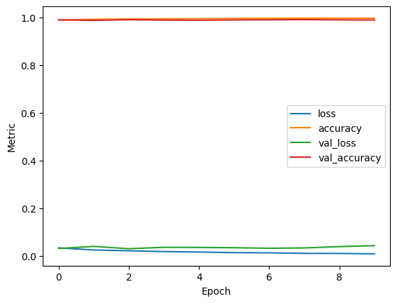
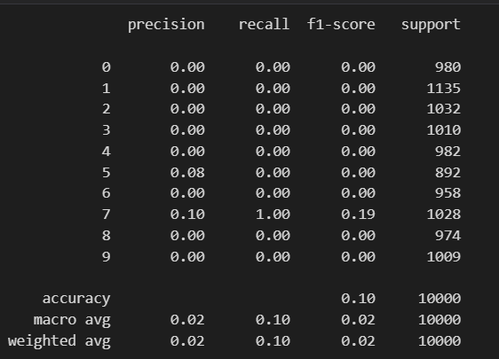
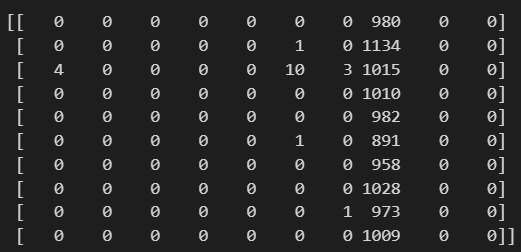
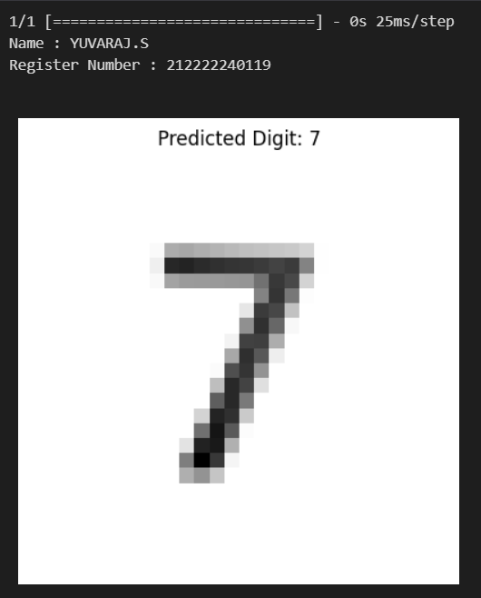

# Convolutional Deep Neural Network for Digit Classification

## AIM

To Develop a convolutional deep neural network for digit classification and to verify the response for scanned handwritten images.

## Problem Statement and Dataset
Problem Statement: Handwritten Digit Recognition with Convolutional Neural Networks

Objective: Develop a Convolutional Neural Network (CNN) model to accurately classify handwritten digits (0-9) from the MNIST dataset.

Data: The MNIST dataset, a widely used benchmark for image classification, contains grayscale images of handwritten digits (28x28 pixels). Each image is labeled with the corresponding digit (0-9).
## Neural Network Model


## DESIGN STEPS

### Step1 : Import Libraries:

tensorflow as tf (or tensorflow.keras for a higher-level API)

### Step2 : Load and Preprocess Data:

Use tf.keras.datasets.mnist.load_data() to get training and testing data.

Normalize pixel values (e.g., divide by 255) for better training.
Consider one-hot encoding labels for multi-class classification.

### Step3 : Define Model Architecture:

Use a sequential model (tf.keras.Sequential).

Start with a Convolutional layer (e.g., Conv2D) with filters and kernel size.

Add pooling layers (e.g., MaxPooling2D) for dimensionality reduction.

Repeat Conv2D and MaxPooling for feature extraction (optional).

Flatten the output from the convolutional layers.

Add Dense layers (e.g., Dense) with neurons for classification.

Use appropriate activation functions (e.g., ReLU) and output activation (e.g., softmax for 10 classes).

### Step4 : Compile the Model:

Specify optimizer (e.g., Adam), loss function (e.g., categorical_crossentropy), and metrics (e.g., accuracy).

### Step5 : Train the Model:

Use model.fit(X_train, y_train, epochs=...) to train.

Provide validation data (X_test, y_test) for monitoring performance.

### Step6 : Evaluate the Model:

Use model.evaluate(X_test, y_test) to assess accuracy and other metrics.

## PROGRAM

### Name: YUVARAJ S
### Register Number:212222240119

#### PREPROCESSING
```py
from tensorflow.keras.datasets import mnist
from tensorflow.keras.models import Sequential
from tensorflow.keras.layers import Conv2D,MaxPooling2D,Dense,Flatten
from tensorflow.keras.metrics import CategoricalCrossentropy
from tensorflow.keras.preprocessing import image
import tensorflow as tf
import pandas as pd
import numpy as np
import matplotlib.pyplot as plt
from sklearn.metrics import classification_report, confusion_matrix
```
#### DATA LOADING AND PREPROCESSING
```py
(x_train,y_train),(x_test,y_test) = mnist.load_data()
x_train.shape
test = x_train[4]
plt.imshow(test,cmap='gray')
x_train.max()
x_train.min()
X_train = x_train/255.0
X_test = x_test/255.0
X_train.max(),X_train.min()
X_test.max(),X_test.min()
X_train.shape
y_train[0]
from tensorflow.keras import utils
y_train = utils.to_categorical(y_train, 10)
y_test_scaled = utils.to_categorical(y_test, 10)
y_train.shape
img = X_train[23]
plt.imshow(img)
X_train = X_train.reshape(-1,28,28,1)
X_test  = X_test.reshape(-1,28,28,1)
type(y_train)
X_train.shape
```
#### MODEL ARCHITECTURE
```py
from tensorflow.keras.models import Sequential
from tensorflow.keras.layers import Conv2D, MaxPooling2D, Dense, Flatten

model = Sequential([
    Conv2D(32, (3,3), activation="relu", input_shape=(28,28,1)),
    MaxPooling2D(pool_size=(2,2)),
    Conv2D(16, (3,3), activation="relu"),
    Conv2D(64, (3,3), activation="relu"),
    MaxPooling2D(pool_size=(2,2)),
    Flatten(),
    Dense(16, activation="relu"),
    Dense(16, activation='relu'),
    Dense(10, activation="softmax")  
])

model.summary()

model.compile(
    'adam', 
    loss ='categorical_crossentropy',
    metrics=['accuracy']
)
model.fit(
    X_train,
    y_train,
    epochs=10,
    validation_data=(X_test,y_test)
)
metrics = pd.DataFrame(model.history.history)
metrics.head()

metrics.plot()
plt.xlabel('Epoch')
plt.ylabel('Metric')
plt.show()

pred = np.argmax(model.predict(X_test),axis=1)
pred[0:10]
y_test[0:10]
print(type(y_test))
print(type(pred))
from sklearn.metrics import classification_report, confusion_matrix
y_test = y_test.ravel()
pred=pred.ravel()
print("Name : YUVARAJ.S\nRegister Number : 212222240119\n")
print(confusion_matrix(y_test,pred))
```
#### PREDICTION
```py
from PIL import Image
input_img_path = '7.jpg'
input_img = Image.open(input_img_path).convert('L') 
input_img = input_img.resize((28, 28))  
input_img = np.array(input_img)  
input_img = input_img.reshape(1, 28, 28, 1)  
input_img = input_img.astype('float32') / 255.0  
predicted_label = model.predict(input_img)
predicted_digit = np.argmax(predicted_label)

print("Name : YUVARAJ.S\nRegister Number : 212222240119\n")

plt.imshow(input_img.reshape(28, 28), cmap='gray')
plt.title(f"Predicted Digit: {predicted_digit}")
plt.axis('off')
plt.show()

```
## OUTPUT

### Training Loss, Validation Loss Vs Iteration Plot



### Classification Report




### Confusion Matrix




### New Sample Data Prediction

#### OUTPUT:



## RESULT
Thus, a convolutional deep neural network for digit classification and to verify the response for scanned handwritten images is written and executed successfully.
